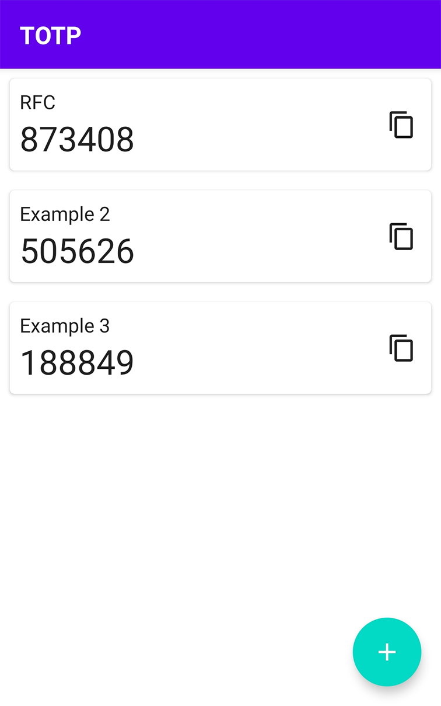

# Android TOTP

Authenticator app for generating Time-based One Time Passwords on Android.

App supports adding, removing and editing one time password keys, and copying 
current codes.

Generation is based on [RFC 6238](https://www.rfc-editor.org/rfc/rfc6238),
currently only supports SHA-1 as hash algorithm, 30 seconds time step and 6
digit output passwords. Secret values (keys) needed for the TOTP algorithm are 
stored in an SQLite database encrypted by a master key. The master key is 
generated and stored in a KeyStore using AndroidKeyStore provider. Currently no 
user authentication is required to use the master key (I am working on adding 
some sort of authentication in the future).

### Technologies used

- Kotlin
- Compose
- Room with Flow
- Android Keystore System
- Hilt

### Screenshots

### How to Build

Requirements:

- Java SDK of version 19 or lower in `JAVA_HOME` environmental variable - 
building was tested with Java 17, lower versions may work too.
- Android SDK in `ANDROID_SDK_ROOT` environmental variable and/or in 
`local.properties` file in the root of the project as `sdk.dir=/path/to/sdk`
- (Optional) `GRADLE_USER_HOME` environmental variable defines where to store 
gradle wrapper distributions and some other files. If this variable doesn't 
exist, Gradle will store its data in `<path to user home folder>/.gradle`.

Building from command line is described on developer.android.com website 
[here](https://developer.android.com/build/building-cmdline#build_apk).

To build an apk with IntelliJ / Android Studio, open the project and:

- For release version - open `Build` > `Generate Signed Bundle / APK` and follow
the instructions.
- For debug version - use `Build` > `Build Bundle(s) / APK(s)` > `Build APK(s)`
or run `assembleDebug` task in Gradle.

Generated apk can be found in `app/build/outputs/apk` folder.